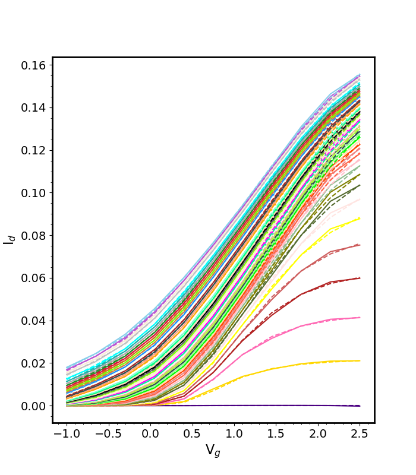
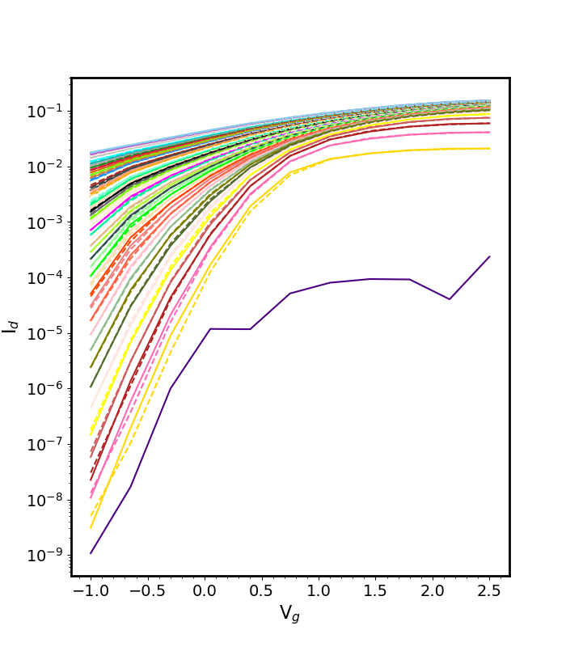
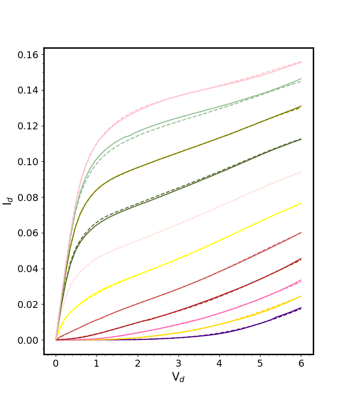
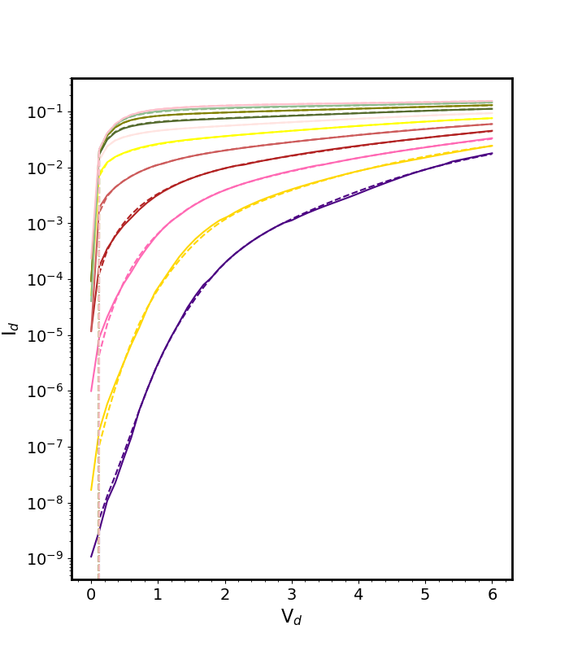

# PiNN2: device compact modeling using neural neworks
## Why PiNN2
PiNN2 is the **ONLY** platform can model both ON region and subthreshold region of a transistor very accurately and efficiently. It is written in Python and provides easy-to-use APIs.

An example HEMT model is shown below. The dash line is the model and the solid line is the experimental data. The training time is only several minutes using a Macbook Pro Laptop (with NNPACK).

## Install
Install Caffe2 from https://github.com/Oscarlight/caffe2.git. The forked repo contains some new layers created for this project. The instruction about how to install caffe2 is in https://caffe2.ai.

In order to make advantage of multi-core CPU, you need to install NNPack (Following steps are for Ubuntu system):
(If you are using a virtual env, run the python related install in your virtual env)
1. Download Ninja 1.7.2 from https://github.com/ninja-build/ninja/releases
2. Enter the folder, run ./configure.py --bootstrap
3. Run ./configure.py && ./ninja ninja_test && ./ninja_test --gtest_filter=-SubprocessTest.SetWithLots to test
4. sudo install ninja /usr/bin/
5. [sudo] pip install --upgrade git+https://github.com/Maratyszcza/PeachPy
6. [sudo] pip install --upgrade git+https://github.com/Maratyszcza/confu
7. git clone https://github.com/Maratyszcza/NNPACK.git
8. cd NNPACK
9. confu setup
10. python ./configure.py
11. ninja

If you consider data reading is the bottleneck, you could install rocksdb from https://github.com/facebook/rocksdb/blob/master/INSTALL.md.

Remember to re-build caffe2 after install NNPack and RocksDB.

## What can it do?
- DC IV modeling using Pi-NN (Completed)
- AC IV and QV modeling using adjoint neural network (Coming soon)

## How to use it?
- DC IV APIs
  - DCModel class
  examples: hemt_example_1.py (more examples are coming soon)

## Reference:
- Jianjun Xu, M. C. E. Yagoub, Runtao Ding and Qi Jun Zhang, "Exact adjoint sensitivity analysis for neural-based microwave modeling and design," in IEEE Transactions on Microwave Theory and Techniques, vol. 51, no. 1, pp. 226-237, Jan 2003.
doi: 10.1109/TMTT.2002.806910
- M. Li, O. İrsoy, C. Cardie and H. G. Xing, "Physics-Inspired Neural Networks for Efficient Device Compact Modeling," in IEEE Journal on Exploratory Solid-State Computational Devices and Circuits, vol. 2, no. , pp. 44-49, Dec. 2016.
doi: 10.1109/JXCDC.2016.2636161
